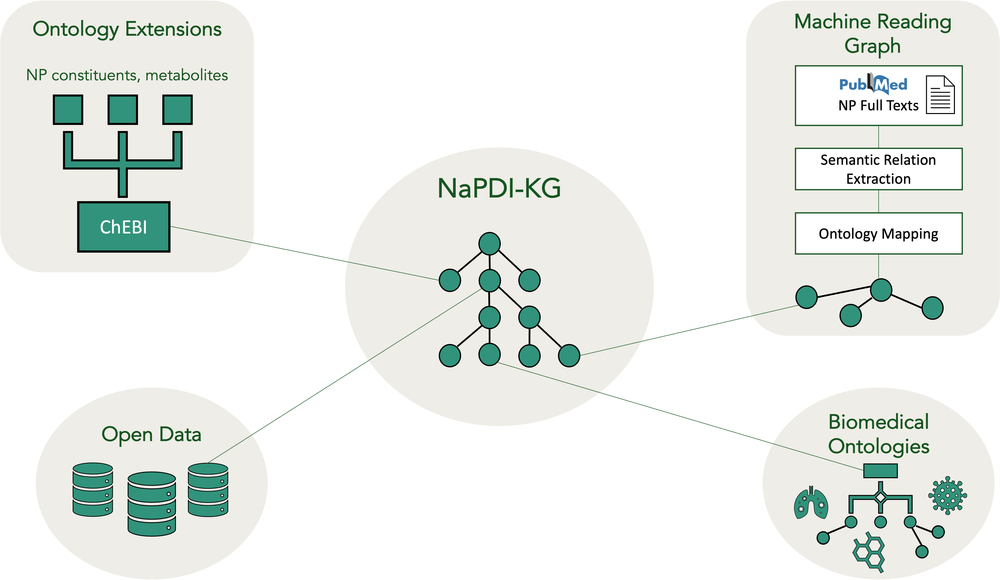

NaPDI-KG
================================================
**Knowledge Graph Framework to Generate Hypotheses for Natural Product-Drug Interactions**

Documentation
------------------------------------------------

NaPDI-KG is a knowledge graph framework to identify and generate mechanistic hypotheses for pharmacokinetic natural product-drug interactions (NPDIs). This repository has been forked from the [Knowledge-Graph-Hub](https://github.com/Knowledge-Graph-Hub). NaPDI-KG uses the [PheKnowLator ecosystem](https://github.com/callahantiff/PheKnowLator) to create the ontology-grounded KG and the KG-Hub ecosystem to integrate the nodes and edges extracted from natural product-related biomedical literature. NaPDI-KG includes the following components -

1. Biomedical Ontologies

2. Ontology Extensions for Natural Products

3. Biomedical Literature

4. Linked Open Data

Notes about PheKnowLator workflow
------------------------------------------------

This repository only contains the reference Jupyter notebooks used to run the [PheKnowLator](https://github.com/callahantiff/PheKnowLator) workflow. For complete details on semantic integration of OBO ontologies and biomedical data sources in NaPDI-KG as well as latest versions of Jupyter notebooks run as part of the PheKnowLator workflow, refer to this [fork of the PheKnowLator repository](https://github.com/sanyabt/PheKnowLator/tree/pheknowlator-sbt).

Other Links
------------------------------------------------

* KG-Hub documentation [here](https://github.com/sanyabt/napdi-kg/blob/master/README-KG-Hub.md).
* [Recorded talk](https://pitt.hosted.panopto.com/Panopto/Pages/Viewer.aspx?id=a65ba3b6-3680-4b1f-ac34-adf301405b94) presenting NaPDI-KG at the Pittsburgh-CMU Medical Informatics Colloquium (PCMIC) in December 2021.

Get In Touch
------------------------------------------------

Get in touch through GitHub issues, discussion, or [email](mailto:sbt12@pitt.edu)!

Citations
------------------------------------------------

**AMIA Informatics Summit poster**

Taneja SB, Ndungu PW, Paine MF, Kane-Gill SL, Boyce RD. Relation Extraction from Biomedical Literature on Pharmacokinetic Natural Product-Drug Interactions. Poster presentation, AMIA Informatics Summit 2022; March 21-24, 2022.

**ISMB Conference Abstract and Related Files**

Taneja SB, Callahan TJ, Brochhausen M, Paine MF, Kane-Gill SL, Boyce RD. Designing potential extensions from G-SRS to ChEBI to identify natural product-drug interactions. Intelligent Systems for Molecular Biology/European Conference on Computational Biology (ISMB/ECCB), 2021. [https://doi.org/10.5281/zenodo.5736386](https://doi.org/10.5281/zenodo.5736386)

This work is supported by the National Institutes of Health National Center for Complementary and Integrative Health Grant U54 AT008909.